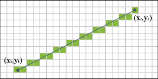
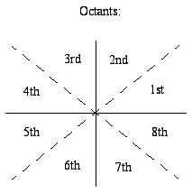

# Breseham's line algorithm
---
Algorítimos de Rasterização

## Índice

* [Introdução](#introdução)
* [Pixels](#pixels)
* [Algoritmo de Bresenham](#algoritmo-de-bresenham)
* [Triângulos](#triângulos)
* [Interpolação Linear de Cores](#interpolação-linear-de-cores)
* [Conclusão](#conclusão)
* [Contribuidores](#contribuidores)
* [Referências Bibliográficas](#referências-bibliográficas)

---

### Introdução
Este trabalho foi desenvolvido para a disciplina de Introdução à Computação Gráfica, ministrada pelo Prof. Dr. Christian Azambuja Pagot, na Universidade Federal da Paraíba.

O trabalho trata da implementação do algorítmo de Bresenham para a rasterização de primitivas geométricas nas linguagens C/C++.
A compilação exige que os cabeçalhos do OpenGL e a GLUT (The OpenGL Toolkit) estejam instalados. Após instalá-los:

$ make

$ ./cgprog

Com a evolução das tecnologias, e por questões de segurança, os sistemas operacionais atuais impedem o acesso direto a memória à memória de vídeo. Por esse motivo, será usado um framework desenvolvido pelo professor que simula esse acesso à memória.

---

### Pixels

Os monitores da atualidade são compostos por uma malha de pixels, com X pixels de largura por Y pixels de altura, formando um espaço bidimensional. Entretanto, a disposição desses pixels na memória de vídeo se dá de forma linear, onde todos os pixels são armazenados de forma contínua no que chamamos de *colour buffer*. Este fato deve ser levado em consideração quando se trabalha com a manipulação de pixels.

A maioria dos monitores no mercado utilizam o padrão RGBA, onde cada pixel possui 4 componentes de cor: R para vermelho (RED), G para verde (GREEN), B para azul (BLUE) e A para transparência (ALPHA). Cada componente ocupa 1 byte do *colour buffer*, totalizando 4 bytes por pixel. Para facilitar o entendimento, vejamos o seguinte esquema:


<p align="center">
	<br>
	
	<h5 align="center">Figura 1 - Disposição dos pixels na memória</h5>
	<br>
</p>

Além disso, temos capacidade de endereçar cada pixel (e cada canal de cor) no *colour buffer* da seguinte forma:

<p align="center">
	<br>
	
	<h5 align="center">Figura 2 - Endereçamento de pixels no colour buffer</h5>
	<br>
</p>

Com essas informações, foi implementado um tipo estruturado **pixel** contendo todas as informações de coordenadas e cores dele:

```C++
typedef struct Pixel {
    int x;
    int y;

    double red;
    double green;
    double blue;
    double alpha;
} Pixel;
```

A fim de desenhar um pixel na tela, foi criada a função **putPixel()** que recebe como parâmentro um pixel (com suas informações de cor e coordenadas) e rasteriza um ponto na tela. No framework desenvolvido pelo professor, existe um ponteiro **FBPtr** que aponta para a primeira posição do *colour buffer*, e isso possibilitou a implementação de tal função:

``` C++
void putPixel(Pixel p) {
	
	if(p.x>IMAGE_WIDTH || p.x<0 || p.y>IMAGE_HEIGHT || p.y<0) return; 
	
	int endereco = p.x*4 + p.y*4*IMAGE_WIDTH;
	FBptr[endereco] = p.red;
	FBptr[endereco + 1] = p.green;
	FBptr[endereco + 2] = p.blue;
	FBptr[endereco + 3] = p.alpha;
}
```
Obtivemos esses resultados:
<p align="center">
	<br>
	
	<h5 align="center">Figura 3 - Função putPixel()</h5>
	<br>
</p>

### Algoritmo de Bresenham

A etapa mais complicada do projeto foi a rasterização de linhas. Para isso, foi criada a função **drawLine()**, que recebe dois pixels como parâmetro, e desenha uma reta aproximada entre eles.

Para essa função foi utilizado o algoritmo de Bresenham, muito utilizado na computação para rasterização de linhas. O algoritmo de Bresenham, de forma simplificada, busca aproximar uma reta (que sabemos que é contínua), para um universo discreto. Para isso, transforma-se a linha a ser desenhada em uma equação de reta, da forma y = mx + b.

A cada incremento de x, y incrementa baseado na inclinação m. Isso, porém, quer dizer que y assumirá valores de pontos flutuante, o que dificulta a representação por meio de pixels. O algoritmo de Bresenham chega então na etapa de decisão: a cada vez que x muda, verifica-se se o valor de y equivalente está mais próximo do y atual, ou de y + 1. Após a decisão, o pixel escolhido é acendido. Isso pode ser visto de uma forma melhor na seguinte imagem: 

<p align="center">
	<br>
	
	<h5 align="center">Figura 4 - Linha de Bresenham </h5>
	<br>
</p>

Porém, da forma apresentada, o algoritmo funciona apenas para linhas no primeiro octante. Isso é, o octante em que o deslocamento em xe y são positivos, e a inclinação da reta está entre 0º e 45º graus. 

<p align="center">
	<br>
	
	<h5 align="center">Figura 5 - Octantes </h5>
	<br>
</p>

Para a implementação funcionar para qualquer reta, foi necessário generalizar o algoritmo. Além disso, retas horizontais e retas verticais foram implementados separadamente das retas inclinadas. O algoritmo foi implementado da seguinte forma: 

```C++
void drawLine(Pixel inicial, Pixel final){
    int xi = inicial.x;
    int xf = final.x;
    int yi = inicial.y;
    int yf = final.y;
    int dx = abs(xf - xi);
    int dy = abs(yf - yi);
    int controle = 0;   //Controla se a direção menor vai crescer ou nao;
    int incX = 0;
    int incY = 0;

    //Define se Y e X estão indo nas direções positivas ou negativas
    if(xf > xi) incX = 1;
    else incX = -1;

    if(yf > yi) incY = 1;
    else incY = -1;

    putPixel(inicial);
    Pixel linha = {inicial.x, inicial.y, inicial.red, inicial.green, inicial.blue, inicial.alpha};  //Esse pixel é o que se moverá e pintará a linha
```

Essa é a parte inicial da função, que vai definir em qual octante será desenhada linha, baseado nos pixels passados como parâmetro. Também é criado o pixel "linha", que será nosso pixel "ambulante". Isso é, será ele que percorrerá a linha, mudando de coordenadas, e pintando cada pixel individual.

```C++
    if(dx == 0){
        if(yf > yi){    //linha pra baixo
            while(linha.y != yf)
            {

                linha.y++;              
                putPixel(linha);

            }
        }
        else{           //linha pra cima
            while(linha.y != yf)
            {

                linha.y--;               
                putPixel(linha);

            }
        }

    }
    else if(dy == 0){
        if(xf > xi){    //linha pra direita
            while(linha.x != xf)
            {

                linha.x++;                
                putPixel(linha);

            }
        }
        else{           //linha pra esquerda
            while(linha.x != xf)
            {

                linha.x--;                
                putPixel(linha);

            }
        }
    }
``` 
Essa parte ficou responsável por pintar linhas sem inclinação.
```C++
else {
        if (dx >= dy) {

            controle = dx / 2;
            putPixel(inicial);
            while (linha.x != xf) {
                linha.x += incX;
                controle = controle - dy;
                if (controle < 0) {
                    linha.y += incY;
                    controle += dx;
                }                
                putPixel(linha);
            }

        } else {
            controle = dy / 2;
            putPixel(inicial);
            while (linha.y != yf) {
                linha.y += incY;
                controle = controle - dx;
                if (controle < 0) {
                    linha.x += incX;
                    controle += dy;
                }                
                putPixel(linha);
            }

        }
```

O primeiro if desenha linhas em que o deslocamento x é maior do que deslocamento y. Isso é, nos octantes 1, 4, 5, e 8. Por consequência, o else é responsável pelos octantes 2, 3, 6, e 7. Após a implementação, podemos verificar o resultado: 

<p align="center">
	<br>
	
	<h5 align="center">Figura 6 - Função drawTriangle()</h5>
	<br>
</p>


### Triângulos

Passada a implementação mais complicada do projeto, vamos tirar proveito do funcionamento da função **drawLine()** para desenvolver a função **drawTriangle()**. Esta função recebe como parâmentro 3 pixels que representam os vértices do triângulo. A função, então, rasteriza 3 linhas ligando os vértices:


Como resultado, obtivemos:
<p align="center">
	<br>
	
	<h5 align="center">Figura 6 - Função drawTriangle()</h5>
	<br>
</p>
<p align="center">
	<br>
	
	<h5 align="center">Figura 7 - Função drawTriangle()</h5>
	<br>
</p>

### Interpolação Linear de Cores

Como última tarefa do projeto, fizemos a interpolação das cores desde o começo da linha até o fim. Com isso, uma transição gradual de cores acontece dependendo da distância entre seus pontos finais e iniciais.

Primeiro, foi criada uma função chamada **setarDist()**, que recebe como parâmetro dois pixels (inicial e final) e um ponteiro para *struct Steps*, que por sua vez armazena a variação de cor de cada canal dos pixels. A função **setarDist()** é responsável por calcular a hipotenusa desses dois pixels (ou seja, a distância entre eles), a distância entre os componentes RGBA e definir o quanto cada cor irá incrementar/decrementar a cada pixel. Vejamos:

```C++
typedef struct Steps {

    double redStep;
    double greenStep;
    double blueStep;
    double alphaStep;

} Steps;

void setarDist(Pixel inicial, Pixel final, Steps *dist){
    int dx = final.x - inicial.x;
    int dy = final.y - inicial.y;

    double hypo = sqrt(dx*dx + dy*dy);

    //Define o quanto cada cor irá incrementar/decrementar a cada pixel
    dist->redStep = (final.red - inicial.red)/hypo;
    dist->greenStep = (final.green - inicial.green)/hypo;
    dist->blueStep = (final.blue - inicial.blue)/hypo;
    dist->alphaStep = (final.alpha - inicial.alpha)/hypo;
}
```

Por fim, foi criada a função **interpolar()** que recebe como parâmetro um ponteiro para o pixel inicial que será acendido na tela e todas as suas informações de distância contidas em *Steps*. Nessa função, é realizado o cálculo para se obter os novos valores RGBA, baseados na distância que falta para chegar nos valores RGBA do pixel final. Cada ponto a ser gerado na linha vai possuir valores de cor mais próximos do valor final, resultando numa mudança gradual da cor da linha.
```C++
void interpolar(Pixel *inicial, Steps dist){
    inicial->red += dist.redStep;
    inicial->green += dist.greenStep;
    inicial->blue += dist.blueStep;
    inicial->alpha += dist.alphaStep;
}
```

Após isso, temos que implementar a interpolação ma função **drawLine()**. De começo, temos que setar os incrementos de cores a cada pixel. Isso é feito logo antes de se colocar o pixel inicial:

```C++
...
Steps steps;
setarDist(inicial,final,&steps);
putPixel(inicial);
...
```
 
Esses cálculos serão sempre realizados antes da impressão do pixel na tela, portanto, sempre antes da chamada **putPixel()**.

```C++
...
interpolar(&linha,steps);
putPixel(linha);
...
```

Esses são os resultados:
<p align="center">
	<br>
	
	<h5 align="center">Figura 8 - Função interpolar()</h5>
	<br>
</p>

<p align="center">
	<br>
	
	<h5 align="center">Figura 9 - Função interpolar()</h5>
	<br>
</p>

### Conclusão

Após o desenvolvimento deste trabalho, ficou claro que a maior dificuldade foi a compreensão do algorítimo de Bresenham. Leva um pouco de tempo até se compreender como funciona, o que se repete, o que se incrementa ou decrementa. Além disso, a generalização para os outros octantes exige um pouco de raciocínio.

Com esse trabalho fomos capazes de compreender afundo como funciona a rasterização de primitivas. Foi uma imersão no algorítimo de Bresenham que cuminou em resultados muito satisfatórios em termos de aprendizado.

Possíveis melhorias seriam tentar fazer novos tipos de linhas, mais grossos por exemplo. Além disso, seria interessante preencher os triângulos.

### Contribuidores

* [Hanrell Ramon Ribeiro de Souza](https://github.com/hanrell)
* [Iderval da Costa e Silva Neto](https://github.com/rocinante02)

### Referências Bibliográficas

* Notas de aula do Prof. Christian
* [Bleeptrack - Bresenham Algorithmus](http://www.bleeptrack.de/tutorials/bresenham/)
* [Bresenham's line algorithm](https://en.wikipedia.org/wiki/Bresenham%27s_line_algorithm)
