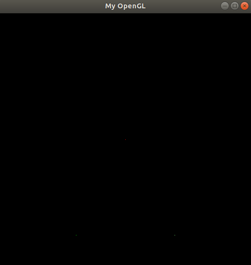
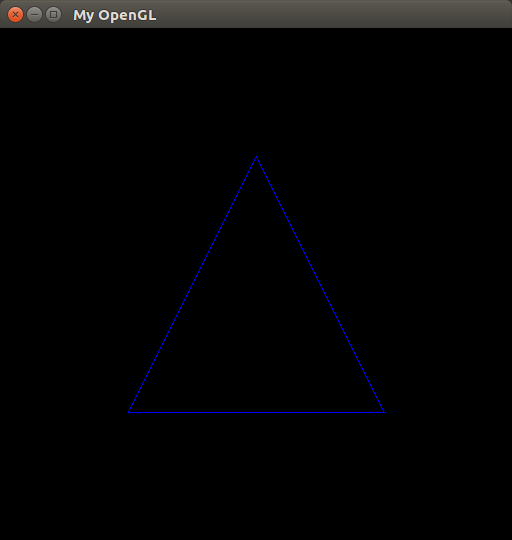
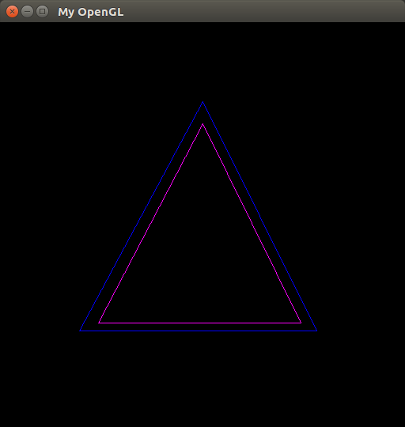
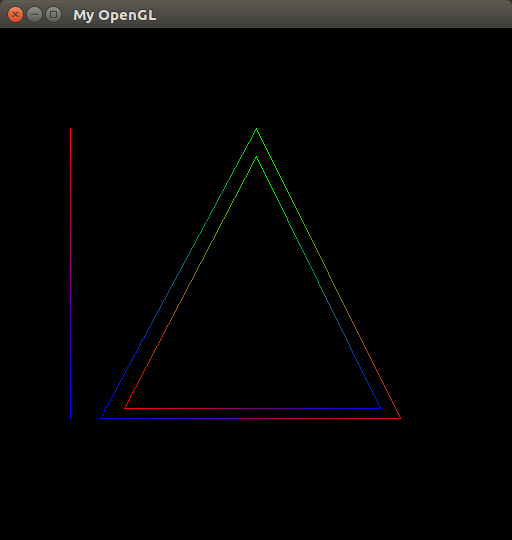
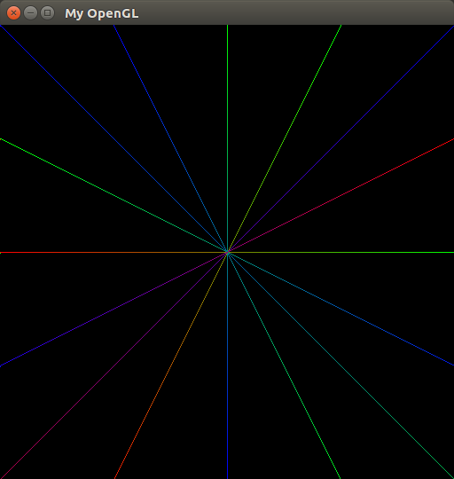

# Breseham's line algorithm
---
Algorítimos de Rasterização

## Índice

* [Introdução](#introdução)
* [Pixels](#pixels)
* [?](#)
* [Triângulos](#triângulos)
* [Interpolação Linear de Cores](#interpolação-linear-de-cores)
* [Conclusion](#conclusion)
* [References](#references)
* [Build Instructions](#build-instructions)

---

### Introdução
Este trabalho foi desenvolvido para a disciplina de Introdução à Computação Gŕafica, ministrada pelo Prof. Dr. Christian Azambuja Pagot, na Universidade Federal da Paraíba.

O trabalho trata da implementação do algorítmo de Bresenham para a rasterização de primitivas geométricas nas linguagens C/C++.
A compilação exige que os cabeçalhos do OpenGL e a GLUT (The OpenGL Toolkit) estejam instalados. Após instalá-los:

$ make

$ ./cgprog

Com a evolução das tecnologias, e por questões de segurança, os sistemas operacionais atuais impedem o acesso direto a memória à memória de vídeo. Por esse motivo, será usado um framework desenvolvido pelo professor que simula esse acesso à memória.

---

### Pixels

Os monitores da atualidade são compostos por uma malha de pixels, com X pixels de largura por Y pixels de altura, formando um espaço bidimensional. Entretanto, a disposição desses pixels na memória de vídeo se dá de forma linear, onde todos os pixels são armazenados de forma contínua no que chamamos de *colour buffer*. Este fato deve ser levado em consideração quando se trabalha com a manipulação de pixels.

A maioria dos monitores no mercado utilizam o padrão RGBA, onde cada pixel possui 4 componentes de cor: R para vermelho (RED), G para verde (GREEN), B para azul (BLUE) e A para transparência (ALPHA). Cada componente ocupa 1 byte do *colour buffer*, totalizando 4 bytes por pixel. Para facilitar o entendimento, vejamos o seguinte esquema:


<p align="center">
	<br>
	
	<h5 align="center">Figura 1 - Disposição dos pixels na memória</h5>
	<br>
</p>

Além disso, temos capacidade de endereçar cada pixel (e cada canal de cor) no *colour buffer* da seguinte forma:

<p align="center">
	<br>
	
	<h5 align="center">Figura 2 - Endereçamento de pixels no colour buffer</h5>
	<br>
</p>

Com essas informações, foi implementado um tipo estruturado **pixel** contendo todas as informações de coordenadas e cores dele:

```C++
typedef struct Pixel {
	int x;
	int y;

    double red;
    double green;
    double blue;
    double alpha;
} Pixel;
```

A fim de desenhar um pixel na tela, foi criada a função **putPixel()** que recebe como parâmentro um pixel (com suas informações de cor e coordenadas) e rasteriza um ponto na tela. No framework desenvolvido pelo professor, existe um ponteiro **FBPtr** que aponta para a primeira posição do *colour buffer*, e isso possibilitou a implementação de tal função:

``` C++
void putPixel(Pixel p) {
	
	if(p.x>IMAGE_WIDTH || p.x<0 || p.y>IMAGE_HEIGHT || p.y<0) return; 
	
	int endereco = p.x*4 + p.y*4*IMAGE_WIDTH;
	FBptr[endereco] = p.red;
	FBptr[endereco + 1] = p.green;
	FBptr[endereco + 2] = p.blue;
	FBptr[endereco + 3] = p.alpha;
}
```
Obtivemos esses resultados:
<p align="center">
	<br>
	
	<h5 align="center">Figura 3 - Função putPixel()</h5>
	<br>
</p>

### ?

### Triângulos

Passada a implementação mais complicada do projeto, vamos tirar proveito do funcionamento da função **drawLine()** para desenvolver a função **drawTriangle()**. Esta função recebe como parâmentro 3 pixels que representam os vértices do triângulo. A função, então, rasteriza 3 linhas ligando os vértices:

```C++
void drawTriangle(Pixel p1, Pixel p2, Pixel p3){
    drawLine(p1,p2);
    drawLine(p2,p3);
    drawLine(p3,p1);
}
```

Como resultado, obtivemos:
<p align="center">
	<br>
	
	<h5 align="center">Figura 4 - Função drawTriangle()</h5>
	<br>
</p>
<p align="center">
	<br>
	
	<h5 align="center">Figura 5 - Função drawTriangle()</h5>
	<br>
</p>

### Interpolação Linear de Cores

Como última tarefa do projeto, fizemos a interpolação das cores desde o começo da linha até o fim. Com isso, uma transição gradual de cores acontece dependendo da distância entre seus pontos finais e iniciais.

Primeiro, foi criada uma função chamada **setarDist()**, que recebe como parâmetro dois pixels (inicial e final) e um ponteiro para *struct Steps*, que por sua vez armazena a variação de cor de cada canal dos pixels. A função **setarDist()** é responsável por calcular a hipotenusa desses dois pixels (ou seja, a distância entre eles), a distância entre os componentes RGBA e definir o quanto cada cor irá incrementar/decrementar a cada pixel. Vejamos:

```C++
typedef struct Steps {

    double redStep;
    double greenStep;
    double blueStep;
    double alphaStep;

} Steps;

void setarDist(Pixel inicial, Pixel final, Steps *dist){
    int dx = final.x - inicial.x;
    int dy = final.y - inicial.y;

    double hypo = sqrt(dx*dx + dy*dy);

    //Define o quanto cada cor irá incrementar/decrementar a cada pixel
    dist->redStep = (final.red - inicial.red)/hypo;
    dist->greenStep = (final.green - inicial.green)/hypo;
    dist->blueStep = (final.blue - inicial.blue)/hypo;
    dist->alphaStep = (final.alpha - inicial.alpha)/hypo;
}
```

Por fim, foi criada a função **interpolar()** que recebe como parâmetro um ponteiro para o pixel inicial que será acendido na tela e todas as suas informações de distância contidas em *Steps*. Nessa função, é realizado o cálculo para se obter os novos valores RGBA, baseados na distância que falta para chegar nos valores RGBA do pixel final. Cada ponto a ser gerado na linha vai possuir valores de cor mais próximos do valor final, resultando numa mudança gradual da cor da linha.
```C++
void interpolar(Pixel *inicial, Steps dist){
    inicial->red += dist.redStep;
    inicial->green += dist.greenStep;
    inicial->blue += dist.blueStep;
    inicial->alpha += dist.alphaStep;
}
```
Esses cálculos serão sempre realizados antes da impressão do pixel na tela, portanto, sempre antes da chamada **putPixel()**.

Esses são os resultados:
<p align="center">
	<br>
	
	<h5 align="center">Figura 6 - Função interpolar()</h5>
	<br>
</p>

<p align="center">
	<br>
	
	<h5 align="center">Figura 7 - Função interpolar()</h5>
	<br>
</p>
